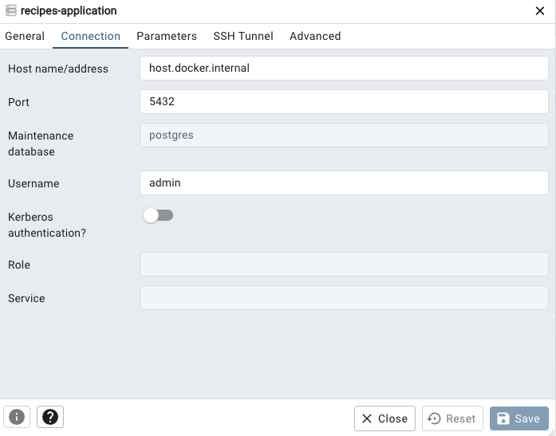

#  ABN-AMRO Recipes Application
ABN AMRO Recipes Application

## Prerequisites
1. Java Development Kit (JDK): Make sure you have JDK 17 installed
2. Docker
3. Docker-compose

## Documentation
[Architecture](./doc/architeture.md)

[Improvements](doc/improvements.md)

## Running the application
#### Once you have the Prerequisites dependencies installed, follow these steps:
1. Clone the repository to your local machine directory
```shell
git clone https://github.com/nelsonjunior-java/abnamro-recipes.git
```

2. Once the build has completed, you can start the docker environment with the following command:
```shell
docker-compose up --build
 ```

4. Once the application has started, you can access the REST API documentation at the following URL:
```
http://localhost:8080/swagger-ui.html
```

5. You can use the API documentation to try out the different endpoints and see how the application works.

### Integration Tests
Run the following command within each service directory for running all the Integration tests:

```shell
mvn clean test -P integration-tests
 ```

## Database
#### To access the PgAdmin (PostgreSQL UI) after the application started, do the following steps:
1. Run this command:
```shell
docker run --name pgadmin \
  -p 80:80 \
  -e PGADMIN_DEFAULT_EMAIL=admin@admin.com \
  -e PGADMIN_DEFAULT_PASSWORD=admin \
  -v pg_admin_volume:/var/lib/pgadmin \
  -d dpage/pgadmin4
```
2. Then access it direclty clicking at the following link:
[http://localhost/browser](http://localhost/browser/)


3. Then you can configure your connection like in the example bellow:



## RabbitMQ

1. You can access it directly through the following link:

    [http://localhost/browser](http://localhost:15672/#/queues)


2. Then you can use the following credentials:

   Username: `admin`

   Password: `admin`

