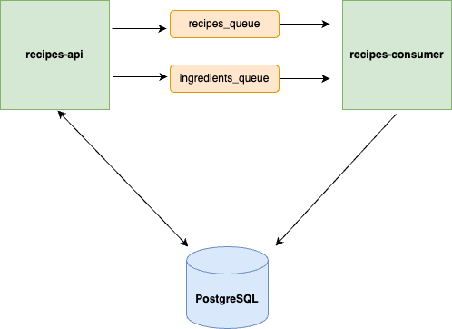

## Architectural Decisions Documentation for Recipes Application

### Overview
The objective of the recipe management application is to provide a standalone Java application that allows users to manage their favorite recipes with features such as adding, updating, removing, and fetching recipes, along with advanced filtering capabilities.

### Architectural Strategy
To meet these requirements, the application architecture was designed with a microservices approach, consisting of two main services:
1. **recipes-api**: Handles all CRUD operations for recipes and ingredients, and communicates with the database and message queue.
2. **recipes-consumer**: Processes messages from the recipes-api via a message queue to perform create operations asynchronously.

### Database Design
The application leverages a shared relational database with tables for `ingredients`, `recipes`, and a join table `recipe_ingredients` to manage the many-to-many relationship between recipes and ingredients. The use of UUIDs ensures uniqueness across distributed systems.

### Search Optimization with tsvector
An important feature of the application is the robust search capability, facilitated by the PostgreSQL `tsvector` type in the `recipes` table. Here's an in-depth look at how this enhances the application's search functionality:

#### Understanding tsvector
- PostgreSQL's `tsvector` type is designed for full-text searching. It stores lexemes (words that have been normalized to merge different variations of the same word).
- The `tsvector` column, `instructions_tsv`, is created to optimize full-text searches on recipe instructions.

#### Advantages of tsvector in Recipe Searches
- **Enhanced Search Efficiency:** The `tsvector` enables efficient full-text searches by using an index, specifically a GIN (Generalized Inverted Index). This means searches are faster, as they operate on pre-processed and indexed data rather than performing a sequential scan of all text data.
- **Advanced Text Matching:** Unlike simple text searches that look for exact matches, `tsvector` supports complex searches including partial matches, synonyms, related terms, and variations in word forms (like singular/plural).
- **Non-Consecutive Keyword Matching:** Users can find recipes based on non-consecutive keywords within the instructions. For example, a search for "bake potatoes" will return recipes containing instructions like "potatoes should be baked until golden", thanks to the intelligent text parsing and indexing capabilities of `tsvector`.
- **Language Support:** The `tsvector` processing includes linguistic considerations, such as stopwords (common but unimportant words like 'and', 'the', etc.), which are omitted to focus the search on significant words only.

#### Trigger for Automatic Update
- A trigger (`instructions_tsv_update`) ensures that any changes to the `instructions` column automatically update the `instructions_tsv` tsvector column. This keeps the search index current without manual intervention.

### Microservices Communication
- **Message Queue with RabbitMQ:** This architecture uses RabbitMQ to decouple the creation operations from the main API service. When a new ingredient or recipe is created, the `recipes-api` publishes a message to a queue which is then consumed by `recipes-consumer`.
- **Advantages of Asynchronous Messaging:**
    - **Scalability:** By decoupling the data creation process, the system can handle higher loads and improve responsiveness.
    - **Reliability:** Messaging ensures that even if the consumer service is temporarily unavailable, messages (tasks) are not lost but are queued and processed later.
    - **Maintainability:** Separating concerns makes the system easier to maintain and evolve as each service can be updated independently.

### Benefits of This Architecture
- **Flexibility and Scalability:** Microservices allow the application to scale components independently based on demand, improving resource utilization.
- **Resilience:** The system is more resilient and can better handle failures as services are loosely coupled.
- **Enhanced Performance:** Asynchronous processing and optimized search capabilities ensure that the application performs efficiently under varying loads.

### Conclusion
The architectural choices made for the recipe management application not only fulfill the functional requirements but also provide a robust, scalable, and efficient system that leverages modern software architecture principles and technologies like microservices, RabbitMQ, and PostgreSQL's advanced search capabilities.
